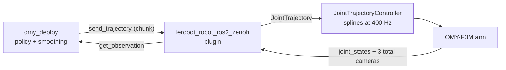

{/* Figures/animations live in static/img/systems/omy/resources/technical_story/vla_showdown/. GIFs animate inline. */}

# The VLA Showdown: Four 2026 Models on the OMY-F3M

LeRobot has recently released four new 2026-generation Vision-Language-Action (VLA) and world models (**GR00T N1.7**, **MolmoAct2**, **VLA-JEPA**, and **FastWAM**) and trained them on the
teleoperation-collected dataset, and ran them on a pick-and-organize long-horizon task on a OMY-F3M arm. This section explains what each model is, how they compare, and the deployment.

<div style={{textAlign: 'center', margin: '30px 0'}}>
  
  <p style={{marginTop: '10px', fontSize: '14px', color: '#888', fontStyle: 'italic'}}>Six standard metrics, each normalized so the outer edge is the ideal (task success 100%, MAE and end-effector error 0, gripper accuracy 100%, smoothness = the human demo, latency 0). GR00T N1.7 is strongest overall but still short of the ideal edge.</p>
</div>

<div style={{margin: '20px 0', padding: '20px', background: 'rgba(102, 126, 234, 0.1)', borderLeft: '4px solid #667eea', borderRadius: '4px'}}>

**Main Results.** On this three-plate organizing task, **only GR00T N1.7 completed the task** (60% end-to-end with ensembling). MolmoAct2 was nearly as accurate *offline* yet grabbed only the first plate; VLA-JEPA and FastWAM did not grasp at all.
</div>

---

## Full demo

<div style={{position: 'relative', maxWidth: '860px', margin: '24px auto', aspectRatio: '16 / 9', background: 'rgba(102,126,234,0.06)', border: '2px dashed #667eea', borderRadius: '12px', display: 'flex', flexDirection: 'column', alignItems: 'center', justifyContent: 'center', textAlign: 'center'}}>
  <div style={{width: 0, height: 0, borderTop: '22px solid transparent', borderBottom: '22px solid transparent', borderLeft: '38px solid #667eea', marginLeft: '8px'}}></div>
  <div style={{marginTop: '16px', fontSize: '17px', fontWeight: 700, color: '#667eea'}}>Full demo video</div>
  <div style={{marginTop: '4px', fontSize: '13px', color: '#888'}}>YouTube embed coming soon</div>
</div>

---

## 1. Task and Data

The arm starts at a fixed home pose. In front of it are three plates: gray (#1), blue (#2), and green
(#3), and a rack of slots. The task is to place plate #1 in the first (left-most) slot, plate #2 in the
third slot, and plate #3 in the fifth. Each plate is a separate subtask with its own language
instruction. A subtask is not a simple pick-and-place, though; the arm must **grab the plate at sufficient
depth, tilt it, and insert it** into the slot.

<div style={{textAlign: 'center', margin: '30px 0'}}>
  
  <p style={{marginTop: '10px', fontSize: '14px', color: '#888', fontStyle: 'italic'}}>The OMY-F3M arm and the three-plate / wooden-slot layout used throughout the study.</p>
</div>

**Dataset.** All four models were fine-tuned on the same dataset with 100 episodes,
184,459 frames at 30 fps, three RGB cameras, and a 7-DOF action/state space (six arm joints plus the
gripper joint `rh_r1_joint`). Actions are **absolute joint positions**, not deltas.

**Data Collection.** Every episode was recorded by teleoperating the
OMY-F3M through [Cyclo Intelligence](/docs/systems/omy/imitation_learning/imitation_learning). 

<div style={{display: 'flex', flexWrap: 'wrap', gap: '2%', justifyContent: 'center', alignItems: 'flex-start', margin: '30px 0'}}>
  <div style={{flex: '1 1 46%', minWidth: '300px', textAlign: 'center'}}>
    
    <p style={{marginTop: '10px', fontSize: '14px', color: '#888', fontStyle: 'italic'}}>Recording an episode.</p>
  </div>
  <div style={{flex: '1 1 46%', minWidth: '300px', textAlign: 'center'}}>
    
    <p style={{marginTop: '10px', fontSize: '14px', color: '#888', fontStyle: 'italic'}}>Reviewing the episodes.</p>
  </div>
</div>

**Three cameras.** A wrist RealSense (a close, moving view of the gripper and plate), a top-down camera
(`camera1`, which sees all plates and slots at once), and a side external camera (`camera2_external`),
so the policy sees roughly three sides of the workspace.

Camera placement matters because it decides how much of the environment the robot can actually perceive.
Thinking of the workspace as a cube, the three cameras must jointly cover enough of its faces for the
policy to localize the plates and slots; here it sees the top, front, and right.

<div style={{display: 'flex', flexWrap: 'wrap', gap: '2%', justifyContent: 'center', alignItems: 'flex-start', margin: '30px 0'}}>
  <div style={{flex: '1 1 46%', minWidth: '280px', textAlign: 'center'}}>
    
    <p style={{marginTop: '10px', fontSize: '14px', color: '#888', fontStyle: 'italic'}}>Camera layout: wrist RealSense, overview (camera1), and side external (camera2_external).</p>
  </div>
  <div style={{flex: '1 1 46%', minWidth: '280px', textAlign: 'center'}}>
    
    <p style={{marginTop: '10px', fontSize: '14px', color: '#888', fontStyle: 'italic'}}>Camera1 covers the top, cam_wrist the front, camera2_external the right; the bottom, back, and left have no camera.</p>
  </div>
</div>

During inference the cameras are *published by the robot* and only *subscribed to* by our tool, so the
first step is to bring the camera drivers up on the robot side.

<details>
<summary>Camera bring-up commands (User computer side)</summary>

Each camera runs in its own terminal, inside the `open_manipulator` Docker container. In **every** terminal, first enter the container and point Zenoh at the robot (replace `robot_ip` with the arm's IP):

```bash
cd open_manipulator
./docker/container.sh enter

# run these in every terminal/window
export RMW_IMPLEMENTATION=rmw_zenoh_cpp
export ZENOH_CONFIG_OVERRIDE='transport/shared_memory/enabled=true;mode="client";connect/endpoints=["tcp/robot_ip:7447"]'
```

Two driver packages are used: `usb_cam` for the two USB cameras and `realsense2_camera` for the wrist RealSense. Bring each camera up in its own terminal.

Launch one `usb_cam` node per USB camera:

```bash
ros2 run usb_cam usb_cam_node_exe --ros-args \
  --remap __node:=usb_cam_NODE \
  -p video_device:=DEVICE \
  -r image_raw:=CAM_KEY/image_raw \
  -r image_raw/compressed:=CAM_KEY/image_raw/compressed \
  -r camera_info:=CAM_KEY/camera_info
```

Fill in the three blanks:

- `NODE` is a unique node name so two `usb_cam` processes do not clash, for example `camera1` or `external2`.
- `DEVICE` is the V4L2 path for that camera, for example `/dev/video6`. List the candidates with `v4l2-ctl --list-devices`. One physical camera often exposes several `/dev/videoN` nodes, and the one that streams is usually the lowest-numbered capture node.
- `CAM_KEY` is the topic namespace, and it must be the exact key the dataset was recorded under (here `camera1` and `cam_external2`). The subscriber matches by this name, so a typo lands the frame nowhere and the policy conditions on a blank image.

Bring the wrist camera up with the RealSense launch file:

```bash
ros2 launch realsense2_camera rs_launch.py \
  camera_name:=CAM_KEY \
  enable_depth:=false \
  depth_module.color_profile:=WIDTHxHEIGHTxFPS \
  depth_module.enable_auto_exposure:=false \
  depth_module.exposure:=EXPOSURE_US \
  depth_module.gain:=GAIN
```

Here `CAM_KEY` follows the same rule as above (the wrist key is `cam_wrist`), and `WIDTHxHEIGHTxFPS` is the colour stream profile, for example `424x240x60`. Depth is disabled because the policy only reads RGB. `EXPOSURE_US` and `GAIN` set a fixed manual exposure (in microseconds) and sensor gain: auto-exposure is turned off so the wrist image does not brighten and darken as the arm moves, which would drift the pixels away from what training saw. Start from `11000` and `25` and adjust until the live image matches the recorded look.

The concrete values used in this study are:

| Camera | `CAM_KEY` | Driver | Device or profile |
| --- | --- | --- | --- |
| Overview | `camera1` | usb_cam | `/dev/video6` |
| Side | `cam_external2` | usb_cam | `/dev/video0` |
| Wrist | `cam_wrist` | realsense2_camera | `424x240x60` |

If a USB camera looks too dark or its colour drifts, reset its controls to a neutral baseline. This is only needed when the live image does not match training:

```bash
for d in DEVICE_A DEVICE_B; do
  v4l2-ctl -d $d --set-ctrl \
    brightness=128,contrast=128,saturation=128,sharpness=128,gain=0,backlight_compensation=0,white_balance_automatic=1,auto_exposure=3
done
```

List the same `/dev/videoN` devices you launched in place of `DEVICE_A` and `DEVICE_B`. The values recentre brightness, contrast, saturation, and sharpness to mid-range, drop the extra gain and backlight compensation, and re-enable automatic white balance and exposure (`auto_exposure=3` is the V4L2 automatic mode).

</details>

<div style={{margin: '20px 0', padding: '20px', background: 'rgba(102, 126, 234, 0.1)', borderLeft: '4px solid #667eea', borderRadius: '4px'}}>

**Camera keys must match training.** On the subscriber side, each camera's `width`/`height` and its `image_keys` value must match **training**, not the live stream. A wrong key means the image lands nowhere and the policy will predict on a blank frame.

</div>

---

## 2. Four Models

Each model is a Vision-Language-Action or World Model policy: it reads the three camera images, the joint state, and
(if it uses language) the instruction, and outputs a short *chunk* of future joint commands. What
differs is the visual/language backbone, how the action "head" turns understanding into motion, and how
much of the network is actually trained. 

Also, note that, compared to regular VLAs that directly translate vision or language data as actions, world models
internally simulates how the physical environment will change over time before deciding what to do.

### 2.1 GR00T N1.7

GR00T N1.7 is NVIDIA's Isaac GR00T, ported into LeRobot. Its backbone is **Cosmos-Reason2-2B**, a Qwen3-VL-family
vision-language model; features are read from an intermediate layer. The action head is a
**flow-matching cross-attention Transformer** (a 32-layer "DiT"): rather than emitting joints directly,
it starts from noise and refines a candidate action chunk over a few integration steps, cross-attending
to the vision-language features. Chunk length is 40 steps, ~3.1 B parameters. 

It is the **only model
whose backbone stays frozen** — only the projector, the vision-language LayerNorm, the action head, and
the top four LLM layers are trained (~2.1 B), because a full fine-tune on 100 episodes would erode the
pretrained priors.

<div style={{textAlign: 'center', margin: '30px 0'}}>
  
  <p style={{marginTop: '10px', fontSize: '14px', color: '#888', fontStyle: 'italic'}}>GR00T N1.7: Cosmos-Reason2-2B backbone + flow-matching DiT action head.</p>
</div>

### 2.2 MolmoAct2

MolmoAct2 is AllenAI's Action Reasoning Model, with three parts: a **SigLIP-style vision Transformer**, an
**OLMo-class 7B language model**, and a separate **flow-matching action expert** that cross-attends to
the vision-language context. It can also emit discrete "FAST" action tokens, but we use the continuous
flow-matching head. 

Chunk length 30, ~5.4 B parameters, **fully fine-tuned.** Only the input
word-embedding table (~0.4 B) is frozen, so ~5.0 B are trained. It is the largest *trained* model here.

<div style={{textAlign: 'center', margin: '30px 0'}}>
  
  <p style={{marginTop: '10px', fontSize: '14px', color: '#888', fontStyle: 'italic'}}>MolmoAct2: SigLIP ViT + OLMo LLM + flow-matching action expert.</p>
</div>

### 2.3 VLA-JEPA

VLA-JEPA is a world-model. A **frozen Qwen3-VL-2B** fuses the images and the instruction;
the hidden states of special action tokens condition a **flow-matching DiT-B action head** (16 layers).
Separately, a **V-JEPA2** video encoder is meant to predict the *latent embedding of the next frame*,
the Joint-Embedding Predictive Architecture idea of imagining the future in feature space, not pixels.

In this study the world-model branch is switched off (it is auto-disabled when the Qwen backbone is
frozen -- using the preconfigured world model but not fine-tuned), so only the ~155 M-parameter action head is trained. Chunk length 30.

<div style={{textAlign: 'center', margin: '30px 0'}}>
  
  
  <p style={{marginTop: '10px', fontSize: '14px', color: '#888', fontStyle: 'italic'}}>VLA-JEPA (frozen Qwen3-VL + V-JEPA2 next-latent predictor + DiT flow head), and its teacher-forcing vs. rollout loss (immediate-step versus multi-step autoregressive forecasting).</p>
</div>

### 2.4 FastWAM

FastWAM is the largest world model here. Its backbone is **Wan2.2-TI2V-5B**, a video-generation Transformer arranged as a
Mixture-of-Transformers: a 5 B-parameter *video expert* and a smaller *action expert* share attention,
alongside a video VAE and a **UMT5-XXL** text encoder. The paper's premise is whether a world model
must actually *imagine* future video at test time, or whether that step can be skipped. 

The action head
is again flow-matching; action horizon 32. ~6 B trainable (full fine-tune), and it **does not fit on a
24 GB GPU** — forcing the CPU-offload deployment discussed in §5.

<div style={{textAlign: 'center', margin: '30px 0'}}>
  
  <p style={{marginTop: '10px', fontSize: '14px', color: '#888', fontStyle: 'italic'}}>FastWAM: Wan2.2-5B video DiT + action expert + UMT5-XXL text encoder + VAE.</p>
</div>

<details>
<summary>What "latent state" and "flow-matching" mean</summary>

Every action head above reads a **latent state** and produces motion by **flow-matching**.

**Latent state.** The vision-language backbone does not output joint angles. It squeezes the camera images and the instruction into one compact vector, the *latent state*, that captures what is in front of the arm and what it was asked to do, as features rather than pixels. Everything downstream reads only this vector.

**Flow-matching.** The action head does not predict the motion in one shot. It starts from pure random noise and cleans it up over a few small steps, and each step nudges the guess a little closer to a real action, until the noise has become a full (or continuous) chunk of joint commands. The network only has to point the direction of each nudge:

$$
a_{\text{next}} \;=\; a_{\text{now}} \;+\; (\text{small step})\times(\text{direction the network predicts}).
$$

Running that from noise to a clean chunk is the whole sampling process. More steps mean smaller, finer nudges, so the chunk comes out smoother and more accurate but takes longer to compute. That step count is the `--flow-steps` knob tuned per model in §5.

<div style={{textAlign: 'center', margin: '24px 0'}}>
<svg viewBox="0 0 920 320" style={{width: '100%', maxWidth: '840px', height: 'auto'}} role="img" aria-label="A vision-language backbone encodes images and the instruction into a latent state, which conditions a flow-matching decoder that refines random noise into an action chunk">
  <defs>
    <marker id="ah" markerWidth="9" markerHeight="9" refX="6" refY="3" orient="auto"><path d="M0,0 L6,3 L0,6 Z" fill="#7b8494" /></marker>
    <marker id="ahb" markerWidth="9" markerHeight="9" refX="6" refY="3" orient="auto"><path d="M0,0 L6,3 L0,6 Z" fill="#4f7fd0" /></marker>
  </defs>

  <rect x="24" y="46" width="120" height="44" rx="6" fill="#2563eb" fillOpacity="0.10" stroke="#4f7fd0" strokeWidth="1.5" />
  <rect x="24" y="118" width="120" height="44" rx="6" fill="#2563eb" fillOpacity="0.10" stroke="#4f7fd0" strokeWidth="1.5" />
  <rect x="192" y="60" width="152" height="90" rx="6" fill="#2563eb" fillOpacity="0.10" stroke="#4f7fd0" strokeWidth="1.5" />
  <rect x="394" y="76" width="128" height="60" rx="6" fill="#2563eb" fillOpacity="0.15" stroke="#4f7fd0" strokeWidth="1.7" />
  <rect x="394" y="206" width="128" height="50" rx="6" fill="#2563eb" fillOpacity="0.06" stroke="#4f7fd0" strokeWidth="1.5" />

  {/* action head as a right-facing decoder trapezoid (short left side, long right side) */}
  <polygon points="568,118 708,84 708,238 568,198" fill="#d9822b" fillOpacity="0.14" stroke="#d9822b" strokeWidth="1.8" strokeLinejoin="round" />

  <rect x="766" y="128" width="130" height="66" rx="6" fill="#2563eb" fillOpacity="0.10" stroke="#4f7fd0" strokeWidth="1.5" />

  <line x1="144" y1="68" x2="188" y2="88" stroke="#7b8494" strokeWidth="1.5" markerEnd="url(#ah)" />
  <line x1="144" y1="140" x2="188" y2="122" stroke="#7b8494" strokeWidth="1.5" markerEnd="url(#ah)" />
  <line x1="344" y1="105" x2="390" y2="106" stroke="#7b8494" strokeWidth="1.5" markerEnd="url(#ah)" />
  <line x1="522" y1="108" x2="565" y2="140" stroke="#7b8494" strokeWidth="1.5" markerEnd="url(#ah)" />
  <line x1="522" y1="230" x2="565" y2="176" stroke="#7b8494" strokeWidth="1.5" markerEnd="url(#ah)" />
  <line x1="708" y1="161" x2="762" y2="160" stroke="#7b8494" strokeWidth="1.5" markerEnd="url(#ah)" />

  {/* epsilon above the random noise */}
  <text x="458" y="199" textAnchor="middle" fontSize="20" fontStyle="italic" fill="currentColor">ε</text>

  {/* small vector arrow below the latent state */}
  <line x1="430" y1="60" x2="486" y2="60" stroke="#4f7fd0" strokeWidth="1.6" markerEnd="url(#ahb)" />
  <text x="458" y="48" textAnchor="middle" fontSize="11" fill="currentColor" opacity="0.75">vector</text>

  <g fill="currentColor" textAnchor="middle" fontSize="13" style={{fontFamily: 'inherit'}}>
    <text x="84" y="72">camera images</text>
    <text x="84" y="144">instruction</text>
    <text x="268" y="101">vision-language</text>
    <text x="268" y="119">backbone</text>
    <text x="458" y="102">latent state</text>
    <text x="458" y="122" fontSize="13" fontStyle="italic">z</text>
    <text x="458" y="235">random noise</text>
    <text x="640" y="144">flow-matching</text>
    <text x="640" y="162">action head</text>
    <text x="640" y="180" fontSize="11" opacity="0.85">(decoder)</text>
    <text x="831" y="156">action chunk</text>
    <text x="831" y="174" fontSize="11" opacity="0.85">(joint waypoints)</text>
    <text x="735" y="152" fontSize="11" opacity="0.85">denoise</text>
  </g>
</svg>
</div>

</details>

### 2.5 At a glance

| | GR00T N1.7 | MolmoAct2 | VLA-JEPA | FastWAM |
|---|---|---|---|---|
| Backbone | Cosmos-Reason2-2B | SigLIP + OLMo 7B | Qwen3-VL-2B (frozen) | Wan2.2-5B video |
| Action head | flow-matching DiT | flow-matching | flow-matching DiT-B | flow-matching |
| World model | none | none | V-JEPA2 (frozen) | Wan video expert |
| Chunk (steps) | 40 | 30 | 30 | 32 |
| Total params | ~3.1 B | ~5.4 B | ~2.5 B | ~6 B |
| Trained params | ~2.1 B | ~5.0 B | ~155 M | ~6 B (full) |
| Fits 24 GB? | yes | no | yes | no |


<div style={{textAlign: 'center', margin: '30px 0'}}>
  
  <p style={{marginTop: '10px', fontSize: '14px', color: '#888', fontStyle: 'italic'}}>Total vs. trained parameters. VLA-JEPA trains only its ~155 M head; GR00T about two-thirds of its network (backbone frozen); MolmoAct2 and FastWAM are larger fine-tunes.</p>
</div>

---

## 3. Training and Offline Accuracy

Each model was trained with its authors' most-recommended or publicly verified configs. The training hardware or GPU count was chosen on size and availability. One thing modified was VLA-JEPA's learning rate ($1\times10^{-4}$, published); it diverged into NaNs on two
runs, so we used $3\times10^{-5}$.

| | GR00T N1.7 | MolmoAct2 | VLA-JEPA | FastWAM |
|---|---|---|---|---|
| Regime | partial (head + top-4 LLM) | full FT | head-only (Qwen frozen) | full FT |
| Final ckpt | 57643 | 20000 | 230574 | 165000 |
| Hardware | 2×A100-80GB | 4×H100-80GB | 1×RTX 4090 | 2×A100-80GB |
| Wall-clock | ~9 h | ~6 h | ~36 h | ~36 h |
| Global batch | 32 | 32 | 8 | 8 |
| Precision | bf16 | bf16 | bf16 | bf16 |

<div style={{textAlign: 'center', margin: '30px 0'}}>
  
  <p style={{marginTop: '10px', fontSize: '14px', color: '#888', fontStyle: 'italic'}}>Training curves (loss vs. step) exported from Weights &amp; Biases.</p>
</div>

**Offline accuracy (held-out MAE).** Before running inference, each checkpoint is scored by replaying
held-out episodes and measuring the mean absolute error between commanded and demonstrated joints.

| Model | Held-out arm MAE (rad) | End-effector error | Source (best ckpt) |
|---|---|---|---|
| **GR00T N1.7** | **0.017** | **7.5 mm** | ckpt 57643, held-out |
| MolmoAct2 | 0.019 | 9.9 mm | ckpt 12000, held-out |
| FastWAM | 0.034 | 24.8 mm | ckpt 105000, held-out |
| VLA-JEPA | 0.038 | 21.2 mm | ckpt 184000, held-out |

<div style={{textAlign: 'center', margin: '30px 0'}}>
  
  <p style={{marginTop: '10px', fontSize: '14px', color: '#888', fontStyle: 'italic'}}>Held-out arm MAE as training proceeds. GR00T and MolmoAct2 improve sharply over their (short) schedules; VLA-JEPA and FastWAM stay essentially flat over much longer ones. Read the trend of each line rather than comparing absolute heights; a "step" is not comparable across different batch sizes.</p>
</div>

<div style={{margin: '20px 0', padding: '20px', background: 'rgba(102, 126, 234, 0.1)', borderLeft: '4px solid #667eea', borderRadius: '4px'}}>

**Offline accuracy is not task success.** MolmoAct2 is nearly as accurate as GR00T *offline* (0.019 vs. 0.017 rad). As §5 shows, that did not translate to the robot at all. Low offline MAE is a necessary standard, but does not promise success.

</div>

---

## 4. Inference Smoothing

Every model emits a *chunk* of future joint commands each tick. Turning those chunks into motion the
arm can actually execute, smoothly and to full grasp depth, is important. This section covers core smoothing strategies. (The other smoothing methods
(seam-interpolation, Savitzky-Golay, RTC) are in the [Appendix](#12-appendix-other-smoothing-methods--token-pruning).) GR00T is used, as an example, to show the efficacy of smoothing methods.

The full inference path is: **observe → pre-process → predict →
post-process → smooth → clamp → send**.

<div style={{textAlign: 'center', margin: '30px 0'}}>
  
  <p style={{marginTop: '10px', fontSize: '14px', color: '#888', fontStyle: 'italic'}}>Each tick, one observation becomes a short chunk of future joint commands, smoothed and rate-limited, published as a single trajectory the controller splines at 400 Hz. The arm is homed and approach-ramped once before the loop begins.</p>
</div>

<details>
<summary>The pipeline in detail: nodes, solvers, and helpers</summary>

**Nodes.**

| Process (node) | What it does |
| --- | --- |
| `omy_deploy` policy loop (Python) | Each tick: reads an observation, runs the model, then smooths, clamps, and publishes the predicted chunk as one trajectory. |
| `lerobot_robot_ros2_zenoh` bridge | Sends the `JointTrajectory` to the controller and relays `joint_states` and camera frames back as the observation. |
| `JointTrajectoryController` (ros2_control, C++) | Fits cubic splines through the trajectory points and drives the actuators at 400 Hz in hard real time. |

One iteration of the loop runs seven stages:

1. **Observe:** `check_observation` reads `joint_states` and the two camera frames, failing loud on a stale or wrong-shaped frame.
2. **Pre-process:** resize and normalize the images, assemble the state, and tokenize the plate instruction, exactly as in training.
3. **Predict:** the policy returns a chunk of future joint commands (16 to 32 waypoints).
4. **Post-process:** un-normalize to radians and snap the gripper to open or closed.
5. **Smooth:** the chosen mode (whole-chunk, ensembling, seam-blend, and so on) stitches overlapping chunks into one continuous stream.
6. **Clamp:** bound every waypoint to the joint position and velocity limits.
7. **Send:** `send_trajectory` publishes the chunk as one multi-point `JointTrajectory` with per-waypoint velocities.

**Solvers.** There is no learned controller in the loop. The one solver is the `JointTrajectoryController`: it fits a cubic spline between consecutive waypoints, so a coarse chunk becomes a smooth 400 Hz command. Each waypoint carries a position and a velocity (a central difference of the chunk), and matching those velocities is what bridges each waypoint smoothly instead of leaving a corner.

<div style={{textAlign: 'center', margin: '24px 0'}}>
  
  <p style={{marginTop: '10px', fontSize: '14px', color: '#888', fontStyle: 'italic'}}>Linear interpolation (grey) leaves a corner at every waypoint. The cubic spline (navy) passes through the same points and matches the attached velocity (gold tangent), so the 400 Hz command stays smooth.</p>
</div>

**Helpers.** Three pieces sit on top of the bridge: `send_trajectory` does the whole-chunk publish, `install_timed_send_action` times that publish to the right chunk offset (the grab-depth fix in §7), and `check_observation` is the fail-loud reader from stage 1.

</details>

### 4.1 Whole Chunks

A `JointTrajectoryController` interpolates between the points of a trajectory with splines, in C++, on a
hard real-time loop at 400 Hz. If instead we stream one one-point goal per Python tick, the arm sprints
to each target in a few milliseconds and then idles waiting for the next command: accelerate, stop,
accelerate, stop, many times a second. This may cause audible grinding.

<div style={{textAlign: 'center', margin: '30px 0'}}>
  
  <p style={{marginTop: '10px', fontSize: '14px', color: '#888', fontStyle: 'italic'}}>Point-by-point (grey) makes the arm sprint to each goal and idle until the next, a stair-stepped command the actuators grind through. Publishing the whole chunk (navy) lets the controller spline all the points at 400 Hz, so the motion is continuous.</p>
</div>

<details>
<summary>send_trajectory core (Python)</summary>

```python
# core of send_trajectory: one multi-point JointTrajectory with per-waypoint velocities (abridged)
step = dt / speed                        # seconds between chunk points, time-scaled by --speed
vel = central_difference(chunk) / step   # per-waypoint velocity -> cubic-spline continuity
vel[:, gripper] = 0.0                    # gripper is near-binary; a huge velocity would be rejected
points = [JointTrajectoryPoint(positions=q, velocities=v, time_from_start=Duration((i+1)*step))
          for i, (q, v) in enumerate(zip(chunk, vel))]
publisher.publish(joint_names=joints, points=points)
```

</details>

The commands below use two placeholders. `CKPT` is the path to a trained checkpoint (the name differs
per model and run), and `TASKS` is the per-plate instruction string. For example:

```bash
CKPT=outputs/train/groot_plates100_10ep/checkpoints/057643/pretrained_model
TASKS="Place gray plate #1 in the first slot.||Place blue plate #2 in the third slot.||Place green plate #3 in the fifth slot."
```

### 4.2 More Integration Steps

A dense recorder (logging commanded vs. actual joints at ~250 Hz) split the judder cleanly: about
**77%** of the velocity dips happen *inside* a chunk, and **23%** *at* its boundaries. The 77% is not
inherent policy jitter; rather, it is due to the flow-matching head as it builds a chunk by taking `N` small integration steps from
noise toward the final motion. 

<div style={{textAlign: 'center', margin: '20px 0'}}>
  
  <p style={{marginTop: '10px', fontSize: '14px', color: '#888', fontStyle: 'italic'}}>Coarse (N = 4) vs. converged (N = 32) flow integration: fewer steps leave the chunk rippled; more steps track the target cleanly.</p>
</div>

For example, GR00T's default `N=4` is a quite coarse, so the chunk's *values* carry
high-frequency ripple — and that ripple *is* the within-chunk dip. Raising denoising steps `N` to 16-32
(`--flow-steps`) integrates the flow more finely and removes the ripple **at the source**. The inference time runs
a little longer, but it is minimal next to the vision backbone (per-inference 132 → 135 ms).


<div style={{textAlign: 'center', margin: '30px 0'}}>
  
  <p style={{marginTop: '10px', fontSize: '14px', color: '#888', fontStyle: 'italic'}}>Within-chunk command jerk over three GR00T decodes. 4 → 16 roughly halves the jerk; 16 → 32 adds nothing (the solver has converged). Savitzky-Golay filter drives it lower still, but by low-passing the command, which blunts the genuine grasp/place peaks.</p>
</div>

```bash
# Run it: more denoising (flow-integration) steps, in chunk mode (for example).
omy-infer CKPT --chunk-mode --flow-steps 32
```

### 4.3 Temporal Ensembling

Ensembling gave the best motion. Instead of running one chunk then the next, it re-infers on *every*
tick and, for each upcoming timestep, averages all the overlapping chunk predictions that cover it. A
memoryless policy re-plans from a slightly different (lagging) pose each tick, so the chunks disagree a
little; averaging cancels this out.

<div style={{textAlign: 'center', margin: '20px 0'}}>
  
  <p style={{marginTop: '10px', fontSize: '14px', color: '#888', fontStyle: 'italic'}}>Overlapping chunk predictions are blended by an age weight into one smooth command; the coefficient c controls how strongly the older, committed reach is favoured — and that sets grab depth.</p>
</div>

The one catch is **grab depth**: averaging damps the reach peak, so a naive average grabs short. The
blend weights each prediction by its age, `w = exp(-c·(a_max − age))`. The *oldest* overlapping
prediction is the committed reach (the tail of an old chunk); the *newest* sits near the current pose.
The single coefficient `c` sets how strongly the older reach is favoured. 

Across a sweep of `c`, **`c = 0.15` gave the best success rate**, so it is the default.

<details>
<summary>What each `c` value does (and why it stays non-negative)</summary>

Higher `c` puts *more* weight on the oldest, committed plan, not less. Only `c ≥ 0` is allowed; reach is shown as a percentage of the committed 0.566 rad:

| `c` | How it weights the overlapping plans | Reach depth | On the arm |
| --- | --- | --- | --- |
| `c < 0` | Flips the exponent onto the *newest* plan, whose weight then grows without bound. | n/a | Disallowed: it reverses the goal. The weighting exists to favour the older committed reach; a negative `c` favours the newest near-pose plan instead, so the arm re-commands its current pose and never reaches depth. |
| `c = 0` | Uniform, so every overlapping plan counts equally. | 96.7% | Blends the reach with the current pose and stops halfway (touches but cannot hold). |
| `c ≈ 0.15` *(deployed)* | Tips toward the oldest, committed reach while still tracking the newer plans. | 98.4% | Commits to near-full depth, one smooth command per tick. |
| `c ≈ 0.5` | Collapses almost entirely onto the oldest plan. | 100% | Reaches full depth but lags the live scene and ignores fresh corrections. |

</details> 


There are some additions to improve grabbing:
`--grab-lookahead` (read a few steps ahead during the grab), `--grasp-dwell` (hold at depth as the
gripper closes), `--grip-hold` (debounce the release); `--dwell-break` handles the ~2.5 s home pause so
the arm actually starts.

Chunk mode and ensembling track the demonstration almost identically over a full reach; they differ at
the re-plan seams, where chunk mode dips and ensembling stays continuous:

<div style={{textAlign: 'center', margin: '30px 0'}}>
  
  <p style={{marginTop: '10px', fontSize: '14px', color: '#888', fontStyle: 'italic'}}>Chunk mode vs. GR00T ensembling, decoded open-loop along held-out episode 5: commanded angle for the six arm joints, demonstration dashed, re-plan seams marked. Both run the same flow-integration (denoising) steps. </p>
</div>

<div style={{textAlign: 'center', margin: '30px 0'}}>
  
  <p style={{marginTop: '10px', fontSize: '14px', color: '#888', fontStyle: 'italic'}}>The same episode magnified at a seam (joint4, joint5). Both modes use the same integration (denoising) steps; chunk mode still dips away from the demonstration at the seam, while GR00T ensembling stays continuous.</p>
</div>

Despite the flag name, `--groot-ensemble` is policy-agnostic: age-weighted averaging works for all four policies, not just GR00T.

<div style={{margin: '20px 0', padding: '20px', background: 'rgba(102, 126, 234, 0.1)', borderLeft: '4px solid #667eea', borderRadius: '4px'}}>

**`--speed` scales time, not values.** The actions are absolute joint angles, so scaling the *values* would drive the arm toward its zero pose. `--speed 0.6` plays the same trajectory over more wall-clock. A velocity/acceleration clamp (derived from the dataset) is on by default, so deployed motion is never faster than the demonstrations.

</div>

---

## 5. Deployment Results

Success is measured per plate and split into **grab** (did the arm pick the plate up) and **place** (did
it seat the plate). "Task" is the full three-plate completion; place can never exceed grab. Each rate is
first-try success over **10 trials per plate** with the robot.

<table>
<thead>
<tr style={{background: 'rgba(37,99,235,0.14)'}}>
<th>Model</th><th>P1 grab</th><th>P1 place</th><th>P2 grab</th><th>P2 place</th><th>P3 grab</th><th>P3 place</th><th>Task</th>
</tr>
</thead>
<tbody>
<tr><td>GR00T N1.7 (chunk)</td><td>100</td><td>100</td><td>100</td><td>100</td><td>50</td><td>40</td><td>40</td></tr>
<tr style={{background: 'rgba(217,119,6,0.16)'}}><td><strong>GR00T N1.7 (ensemble)</strong></td><td><strong>100</strong></td><td><strong>100</strong></td><td><strong>100</strong></td><td><strong>100</strong></td><td><strong>60</strong></td><td><strong>60</strong></td><td><strong>60</strong></td></tr>
<tr><td>MolmoAct2</td><td>20</td><td>0</td><td>0</td><td>0</td><td>0</td><td>0</td><td>0</td></tr>
<tr><td>VLA-JEPA</td><td>0</td><td>0</td><td>0</td><td>0</td><td>0</td><td>0</td><td>0</td></tr>
<tr><td>FastWAM</td><td>0</td><td>0</td><td>0</td><td>0</td><td>0</td><td>0</td><td>0</td></tr>
</tbody>
</table>

GR00T completed plates 1 and 2 every time. Plate 3 is harder because it requires extending the arm further,
and the ensemble mode lifted it from 50/40 to 60/60. MolmoAct2 managed only a partial first grab;
VLA-JEPA and FastWAM did not grasp the first plate at all.

<details>
<summary>Why ensembling moves GR00T from 40% to 60%</summary>

Plates 1 and 2 are 100% in both chunk and ensembling, so the change is plate 3, and it comes down to **grabbing**.

<div style={{textAlign: 'center', margin: '20px 0'}}>
<svg viewBox="0 0 900 310" style={{width: '100%', maxWidth: '820px', height: 'auto'}} role="img" aria-label="Three overlapping action chunks; at the current instant the oldest is at a deep step while the newest restarts shallow, with lag arrows from each chunk's deepest step to the next chunk's first step">
    <defs><marker id="lagarrow" markerWidth="8" markerHeight="8" refX="6" refY="3" orient="auto"><path d="M0,0 L6,3 L0,6 Z" fill="#b0463c" /></marker></defs>
    <line x1="389.0" y1="74" x2="389.0" y2="266" stroke="currentColor" strokeWidth="1.5" strokeDasharray="5,4" opacity="0.65" />
    <text x="389.0" y="66" textAnchor="middle" fontSize="13" fontWeight="bold" fill="currentColor">now</text>
    <rect x="150" y="92" width="34" height="26" rx="3" fill="#cfe0f5" stroke="#ffffff" strokeWidth="1" />
    <rect x="187" y="92" width="34" height="26" rx="3" fill="#b6c8e2" stroke="#ffffff" strokeWidth="1" />
    <rect x="224" y="92" width="34" height="26" rx="3" fill="#9db1cf" stroke="#ffffff" strokeWidth="1" />
    <rect x="261" y="92" width="34" height="26" rx="3" fill="#8499bc" stroke="#ffffff" strokeWidth="1" />
    <rect x="298" y="92" width="34" height="26" rx="3" fill="#6a82a8" stroke="#ffffff" strokeWidth="1" />
    <rect x="335" y="92" width="34" height="26" rx="3" fill="#516a95" stroke="#ffffff" strokeWidth="1" />
    <rect x="372" y="92" width="34" height="26" rx="3" fill="#385382" stroke="#d9822b" strokeWidth="2.5" />
    <rect x="409" y="92" width="34" height="26" rx="3" fill="#1f3b6f" stroke="#ffffff" strokeWidth="1" />
    <rect x="261" y="160" width="34" height="26" rx="3" fill="#cfe0f5" stroke="#ffffff" strokeWidth="1" />
    <rect x="298" y="160" width="34" height="26" rx="3" fill="#b6c8e2" stroke="#ffffff" strokeWidth="1" />
    <rect x="335" y="160" width="34" height="26" rx="3" fill="#9db1cf" stroke="#ffffff" strokeWidth="1" />
    <rect x="372" y="160" width="34" height="26" rx="3" fill="#8499bc" stroke="#d9822b" strokeWidth="2.5" />
    <rect x="409" y="160" width="34" height="26" rx="3" fill="#6a82a8" stroke="#ffffff" strokeWidth="1" />
    <rect x="446" y="160" width="34" height="26" rx="3" fill="#516a95" stroke="#ffffff" strokeWidth="1" />
    <rect x="483" y="160" width="34" height="26" rx="3" fill="#385382" stroke="#ffffff" strokeWidth="1" />
    <rect x="520" y="160" width="34" height="26" rx="3" fill="#1f3b6f" stroke="#ffffff" strokeWidth="1" />
    <rect x="372" y="228" width="34" height="26" rx="3" fill="#cfe0f5" stroke="#d9822b" strokeWidth="2.5" />
    <rect x="409" y="228" width="34" height="26" rx="3" fill="#b6c8e2" stroke="#ffffff" strokeWidth="1" />
    <rect x="446" y="228" width="34" height="26" rx="3" fill="#9db1cf" stroke="#ffffff" strokeWidth="1" />
    <rect x="483" y="228" width="34" height="26" rx="3" fill="#8499bc" stroke="#ffffff" strokeWidth="1" />
    <rect x="520" y="228" width="34" height="26" rx="3" fill="#6a82a8" stroke="#ffffff" strokeWidth="1" />
    <rect x="557" y="228" width="34" height="26" rx="3" fill="#516a95" stroke="#ffffff" strokeWidth="1" />
    <rect x="594" y="228" width="34" height="26" rx="3" fill="#385382" stroke="#ffffff" strokeWidth="1" />
    <rect x="631" y="228" width="34" height="26" rx="3" fill="#1f3b6f" stroke="#ffffff" strokeWidth="1" />
    <text x="136" y="110" textAnchor="end" fontSize="13.5" fill="currentColor">oldest</text>
    <text x="136" y="178" textAnchor="end" fontSize="13.5" fill="currentColor">next</text>
    <text x="136" y="246" textAnchor="end" fontSize="13.5" fill="currentColor">newest</text>
    <path d="M426,120 Q352,152 282,158" fill="none" stroke="#b0463c" strokeWidth="2" markerEnd="url(#lagarrow)" />
    <text x="352" y="135" textAnchor="middle" fontSize="12.5" fontStyle="italic" fill="#b0463c">lag</text>
    <path d="M537,188 Q463,220 393,226" fill="none" stroke="#b0463c" strokeWidth="2" markerEnd="url(#lagarrow)" />
    <text x="463" y="203" textAnchor="middle" fontSize="12.5" fontStyle="italic" fill="#b0463c">lag</text>
    <text x="700" y="66" fontSize="12.5" fontWeight="bold" fill="currentColor">age weight</text>
    <rect x="700" y="96" width="96" height="18" rx="3" fill="#d9822b" fillOpacity="0.55" /><text x="804" y="110" fontSize="12" fill="currentColor">most</text>
    <rect x="700" y="164" width="62" height="18" rx="3" fill="#d9822b" fillOpacity="0.38" /><text x="770" y="178" fontSize="12" fill="currentColor"></text>
    <rect x="700" y="232" width="32" height="18" rx="3" fill="#d9822b" fillOpacity="0.22" /><text x="740" y="246" fontSize="12" fill="currentColor">least</text>
    <text x="118" y="290" fontSize="12" fill="currentColor" opacity="0.7">each block = one step of a planned chunk</text>
    <rect x="382" y="279" width="20" height="12" rx="2" fill="#cfe0f5" /><text x="408" y="289" fontSize="12" fill="currentColor" opacity="0.7">early (shallow)</text>
    <rect x="522" y="279" width="20" height="12" rx="2" fill="#1f3b6f" /><text x="548" y="289" fontSize="12" fill="currentColor" opacity="0.7">later (deep)</text>
</svg>
  <p style={{marginTop: '8px', fontSize: '14px', color: '#888', fontStyle: 'italic'}}>At the same instant (orange), the oldest chunk is already at a deep step while the newest restarts shallow. The red arrows are the lag: each chunk's deepest step is discarded and the next chunk begins again near the arm's trailing pose.</p>
</div>

**Why chunk mode lands short.** Every chunk is planned from where the arm is right now, and the arm
always trails the command. So at any instant an older chunk is already deep into its reach, while a
brand-new chunk is still on its first steps, near the arm's trailing position. 

Chunk mode always jumps to
the newest chunk, so it keeps restarting from behind and the command settles slightly shallow. This does not wash out with time nor chunk length either, because each chunk is replaced after a few steps due to the late-responding robot, so its deep steps are discarded before the arm ever reaches them and the replacement starts from the same trailing pose.

**Why the age weight *helps* it.** That shortfall sits almost entirely in the newest chunks. Giving
older chunks more weight lets the chunk that already reached full depth lead the blend, so the command
keeps its depth and still follows the live scene.  The old chunk keeps contributing after the point where chunk mode would have thrown it away, so depth carries across each seam instead of resetting. 

However, it mitigates rather than fixes: the weighting can only re-use plans the policy already produced, so it cannot add reach that was never predicted. Leaning harder on the old plans gets us the last of the depth but may ignore fresh grab corrections, which is maybe why plate 3 is at 60% and not 100%.

A variable `c` scheduler may fix this issue, with a custom curriculum, but that is set as future work.

<div style={{textAlign: 'center', margin: '20px 0'}}>
  
  <p style={{marginTop: '10px', fontSize: '14px', color: '#888', fontStyle: 'italic'}}>Sketch of the idea, not an evaluated result. A fixed c has to serve the whole subtask at once. A scheduled c could stay low while the arm approaches and still tracks the scene, rise into the grasp where the committed depth matters, then relax again for the lift and place.</p>
</div>

**Smoother motion helps too.** The blend is continuous across the seams, so the arm stops decelerating
and re-accelerating at every re-plan (because of robot latency, following newest chunk). That removes the start-stop jerk of chunk mode, which matters most
as the gripper closes.

</details>

**Inference latency** (one `predict_action_chunk` on a single RTX 4090; "per action" divides by chunk
length). All are at 30 Hz.

<table>
<thead>
<tr style={{background: 'rgba(37,99,235,0.14)'}}>
<th>Model</th><th>Latency (ms/chunk)</th><th>Chunk</th><th>Per action (ms)</th><th>Notes</th>
</tr>
</thead>
<tbody>
<tr><td>GR00T N1.7 (chunk)</td><td>76</td><td>40</td><td>1.90</td><td>n/a</td></tr>
<tr style={{background: 'rgba(217,119,6,0.16)'}}><td><strong>GR00T N1.7 (ensemble)</strong></td><td><strong>76</strong></td><td><strong>40</strong></td><td><strong>1.90</strong></td><td><strong>no additional latency cost</strong></td></tr>
<tr><td>MolmoAct2</td><td>137</td><td>30</td><td>4.57</td><td>n/a</td></tr>
<tr><td>VLA-JEPA</td><td>74</td><td>30</td><td>2.47</td><td>n/a</td></tr>
<tr><td>FastWAM</td><td>240</td><td>32</td><td>7.5</td><td>5B DiT needs CPU offload</td></tr>
</tbody>
</table>

Only **GR00T N1.7** with ensembling completes the task best, but plate 3 needs to be trained more. **MolmoAct2** moves okay and grabbed the
first plate about one run in five but never finished; more training doesn't seem to improve. **VLA-JEPA** is strong offline yet fails to grasp on the arm. **FastWAM** produces sensible chunks but its 5 B video DiT does not fit on 24 GB (the
UMT5 text encoder stays on the CPU), carries the highest per-chunk latency, and also fails.

---

## 6. Limitations

The table summarizes where each model falls short on this setup.

| Model | Main limitations |
|---|---|
| GR00T N1.7 | Plate 3 only ~50-60%; occasionally shows dwell at initial position, needs `--dwell-break`; requires ≥24 GB GPU. |
| MolmoAct2 | ~5B params; training needs 4×80 GB; 12k checkpoint grasps but never completes; more training showed no clear convergence. |
| VLA-JEPA | Low offline error; flow head sensitive to learning rate; world model imagination dropped at inference. |
| FastWAM | ~6B params; highest latency, CPU offload required; native action space mismatched to a joint-space robot. |

---

## 7. LeRobot v0.6.0

All four models were trained and evaluated on [**LeRobot v0.6.0**](https://github.com/huggingface/lerobot/tree/v0.6.0). The deployment code is separate and
additive (§7); the changes to the LeRobot fork itself are policy-side. All four reported models were
*already present*; the changes below fix some issues when using OMY with LeRobot.

- **NaN-gradient guard** (`lerobot_train.py`): non-finite gradients poison a whole run (VLA-JEPA:
  248/873 `NaN` tensors in every later checkpoint), and norm-clipping does not stop them. Skip the step.
- **Mixed-resolution cameras** (`processor_groot.py`): 640×480 externals and 424×240 wrist cannot stack
  into one tensor. Upscale smaller views first.
- **FastWAM cameras + proprio** (`fastwam/*`): a 3-camera width that is not a multiple of 16 crashes the
  Wan VAE (split in units of 16); 7-dim proprio ≠ pretrained dim (pad/truncate).
- **Inverted gripper** (`processor_vla_jepa.py`): the gripper mapping was flipped for the OMY
  joint-position convention (gripper MAE 1.58). Flip the sign.
- **Backbone LR** (`configuration_vla_jepa.py`): add `qwen_lr` for a separate backbone learning rate.

<details>
<summary>Three of the fixes, in code (NaN guard, mixed-resolution cameras, inverted gripper)</summary>

```python
# NaN/Inf-gradient guard (lerobot_train.py): a single non-finite step poisons every later checkpoint.
_skip_step = not torch.isfinite(grad_norm)
if _skip_step:
    logging.warning(f"non-finite grad_norm ({grad_norm.item()}); skipping optimizer step")
    optimizer.zero_grad(set_to_none=True)
else:
    optimizer.step()
```

```python
# Mixed-resolution camera stacking for GR00T (processor_groot.py).
# 480x640 externals + 240x424 wrist cannot stack into one (B,T,V,H,W,C) tensor.
shapes = set(c.shape[2:4] for c in cams)
if len(shapes) > 1:
    tgt_h = max(s[0] for s in shapes); tgt_w = max(s[1] for s in shapes)
    cams = [c if c.shape[2:4] == (tgt_h, tgt_w) else resize_view(c, tgt_h, tgt_w) for c in cams]
```

```python
# Inverted-gripper fix for VLA-JEPA (processor_vla_jepa.py).
# Targets are {0 = closed/low, 1 = open/high}; emit +1 for OPEN, -1 for closed.
# The original starVLA mapping (1 - 2*(x>thr)) INVERTED this -> gripper MAE 1.58, ~60% agreement.
a[..., gripper_dim] = 2.0 * (a[..., gripper_dim] > threshold).float() - 1.0
```

</details>

### 7.1 The deployment package

[`lerobot_robot_ros2_zenoh`](https://github.com/ROBOTIS-GIT/lerobot_robot_ros2_zenoh) is ROBOTIS's
open-source bridge that lets a LeRobot policy talk to a ROS 2 robot over the
[Zenoh](/docs/systems/omy/quick_start_guide/zenoh_communication) transport: it carries camera images and
joint states in, and joint commands out.

Our deployment package, `omy_deploy`, is additive: it runs the policy and the smoothing on top of that
bridge, so LeRobot policies can drive the OMY robot without changing the bridge itself.

Read the diagram as one control loop. `omy_deploy` predicts a chunk and hands the whole chunk to the
bridge (`send_trajectory`); the bridge forwards it as a `JointTrajectory` to the
`JointTrajectoryController`, which splines it onto the arm at 400 Hz. The arm's `joint_states` and camera
frames flow back through the bridge, and `omy_deploy` reads them (`get_observation`) to plan the next chunk.



---

## 8. Deployment Code

The deployment code runs against `lerobot_robot_ros2_zenoh`. Reproducing this needs only the
repositories below: LeRobot, the ROS2/Zenoh plugin, and its SDK, plus our one additional package
`omy_deploy`. The `pip install -e` step pulls in the Python libraries each repo declares (PyTorch,
Hugging Face, and so on), so beyond those repos there is no additional code.

```bash
# one-time: LeRobot (local install), the ROS2/Zenoh plugin, and the SDK
git clone https://github.com/huggingface/lerobot.git
git clone https://github.com/ROBOTIS-GIT/lerobot_robot_ros2_zenoh.git
git clone https://github.com/ROBOTIS-GIT/zenoh_ros2_sdk.git
pip install -e lerobot -e zenoh_ros2_sdk -e lerobot_robot_ros2_zenoh

# the deployment package -> into the lerobot directory
cd lerobot
git clone https://github.com/da-dawit/lerobot-omy-tests.git _dep
mv _dep/omy_deploy _dep/omy-infer . && rm -rf _dep
```

```bash
# generalized: set your dataset root and the three per-plate instructions
export DATASET=path/to/your/dataset
export TASKS="<plate 1 instruction>||<plate 2 instruction>||<plate 3 instruction>"

omy-infer CKPT --repo-id your-username/your-dataset --root "$DATASET" \
  --groot-ensemble 0.15 --flow-steps 32 --grab-lookahead 24 --grip-close-delay 0 \
  --grasp-dwell 1.0 --grip-hold 9 --dwell-break --speed 0.6 --seconds 300 --tasks "$TASKS"
```

---

```bash
# example, our best run: GR00T N1.7, ckpt 57643
export DATASET=datasets/plates100_subtask
export TASKS="Place gray plate #1 to the first (very left) slot.||Place blue plate #2 to the third slot, a slot after the gray plate.||Place green plate #3 to the fifth slot, a slot after the blue plate."

omy-infer outputs/train/groot_plates100_10ep/checkpoints/057643/pretrained_model \
  --repo-id dawity/plates100_subtask --root "$DATASET" \
  --groot-ensemble 0.15 --flow-steps 32 --grab-lookahead 24 --grip-close-delay 0 \
  --grasp-dwell 1.0 --grip-hold 9 --dwell-break --speed 0.6 --seconds 300 --tasks "$TASKS"
```
The `--repo-id` and `--root` do not replay any episodes. Inference reads only the dataset's *metadata*:
the normalization statistics including mean, standard deviation (used to normalize the live observation and to un-normalize the predicted
action back to radians) and the feature schema (the camera keys and the joint layout). 

Point them at the
dataset the checkpoint was trained on, set the checkpoint to yours, and see `omy-infer --help` for the
full argument list.

---

## 9. Practical Tips

<div style={{margin: '24px 0'}}>
  <div style={{display: 'flex', gap: '14px', alignItems: 'flex-start', padding: '12px 2px', borderTop: '1px solid var(--ifm-color-emphasis-200)'}}>
    <div style={{fontSize: '20px', flex: '0 0 26px', textAlign: 'center', lineHeight: 1.5}}>〰️</div>
    <div style={{fontSize: '15px', lineHeight: 1.5}}><strong>Run inference in a smoothing mode.</strong> Use chunk or ensemble, never point-by-point (robot-side command below).</div>
  </div>
  <div style={{display: 'flex', gap: '14px', alignItems: 'flex-start', padding: '12px 2px', borderTop: '1px solid var(--ifm-color-emphasis-200)'}}>
    <div style={{fontSize: '20px', flex: '0 0 26px', textAlign: 'center', lineHeight: 1.5}}>🎲</div>
    <div style={{fontSize: '15px', lineHeight: 1.5}}><strong>Collect 100+ varied episodes.</strong> Change background, lighting, and distractors between takes so the policy keys on the plates, not the background.</div>
  </div>
  <div style={{display: 'flex', gap: '14px', alignItems: 'flex-start', padding: '12px 2px', borderTop: '1px solid var(--ifm-color-emphasis-200)'}}>
    <div style={{fontSize: '20px', flex: '0 0 26px', textAlign: 'center', lineHeight: 1.5}}>🖥️</div>
    <div style={{fontSize: '15px', lineHeight: 1.5}}><strong>Budget heavy GPUs.</strong> The 5–6 B models need ≥80 GB; a 24 GB card is inference-only, and FastWAM still needs CPU offload.</div>
  </div>
  <div style={{display: 'flex', gap: '14px', alignItems: 'flex-start', padding: '12px 2px', borderTop: '1px solid var(--ifm-color-emphasis-200)'}}>
    <div style={{fontSize: '20px', flex: '0 0 26px', textAlign: 'center', lineHeight: 1.5}}>📷</div>
    <div style={{fontSize: '15px', lineHeight: 1.5}}><strong>Place cameras well.</strong> Cover enough scene and depth to localize the plates and slots.</div>
  </div>
  <div style={{display: 'flex', gap: '14px', alignItems: 'flex-start', padding: '12px 2px', borderTop: '1px solid var(--ifm-color-emphasis-200)', borderBottom: '1px solid var(--ifm-color-emphasis-200)'}}>
    <div style={{fontSize: '20px', flex: '0 0 26px', textAlign: 'center', lineHeight: 1.5}}>🐢</div>
    <div style={{fontSize: '15px', lineHeight: 1.5}}><strong>Teleoperate slowly.</strong> Jerky or too quick demos may not extract quality data.</div>
  </div>
</div>

<details>
<summary>The smoothing command run on the robot</summary>

On the robot, bring the arm controller up in its smoothed `ros2_control` mode before inference. This loads the smoothed
control profile, so the servos ease between waypoints instead of snapping to each one:

```bash
ros2 launch open_manipulator_bringup omy_f3m_follower_ai.launch.py ros2_control_type:=omy_f3m_smooth
```

</details>

---

## 10. Conclusion

Four 2026 VLA and world models were trained on the same 100-episode, three-camera OMY-F3M dataset and
evaluated on a three-plate organizing task through a shared deployment pipeline. **GR00T N1.7** achieved
the best overall performance — the lowest offline error, the fastest practical inference, and the only
successful completion of the task on the real robot. Motion quality was further improved by inference
refinements (more flow integration, velocity continuity, cross-fading, temporal ensembling), which
produced smoother trajectories and more reliable grasps.

---

## 11. Resources

- [LeRobot](https://github.com/huggingface/lerobot): training/inference framework
- [ROBOTIS lerobot_robot_ros2_zenoh](https://github.com/ROBOTIS-GIT/lerobot_robot_ros2_zenoh): the ROS2/Zenoh transport
- [**omy_deploy**: OMY-F3M deployment toolkit](https://github.com/da-dawit/lerobot-omy-tests): the `omy-infer` launcher and the LeRobot-fork change log
- [GR00T N1.7](https://github.com/NVIDIA/Isaac-GR00T) · [MolmoAct2](https://github.com/allenai/molmoact2) · [FastWAM](https://github.com/yuantianyuan01/FastWAM) · [VLA-JEPA](https://github.com/ginwind/VLA-JEPA/) · [LeRobot Policies](https://huggingface.co/docs/lerobot/en/index)
- Reference (3 Plates) Dataset: [`dawity/plates100_subtask`](https://huggingface.co/datasets/dawity/plates100_subtask)

---

## 12. Appendix: Other Smoothing Methods and Token Pruning

The two techniques in §4 (whole-chunk publish, flow-steps, ensembling) carried our best run. The
following are the remaining smoothing methods and a separate attention study.

<details>
<summary>All five deployment modes</summary>


Section 4 showed only chunk mode and ensembling. Here are all five modes together (vanilla, chunk, RTC, seam-interpolation, and ensembling) on the same rollout.

<div style={{textAlign: 'center', margin: '30px 0'}}>
  
  <p style={{marginTop: '10px', fontSize: '14px', color: '#888', fontStyle: 'italic'}}>All five deployment modes on a live GR00T rollout (held-out episode 5): commanded angle for the six arm joints, demonstration dashed, re-plan seams marked.</p>
</div>

<div style={{textAlign: 'center', margin: '30px 0'}}>
  
  <p style={{marginTop: '10px', fontSize: '14px', color: '#888', fontStyle: 'italic'}}>The same episode magnified at a seam (joint4, joint5): vanilla stair-steps; chunk mode and RTC bump away from the demonstration at the seam (RTC less than chunk); seam-interpolation and ensembling stay continuous.</p>
</div>

The three unexplained individual methods:

<details>
<summary>Seam-interpolation: cross-fade the boundaries</summary>


The 23% of dips at chunk boundaries come from stitching consecutive chunks. The smoother resamples each
chunk from 30 Hz up to the 400 Hz control rate, then *cross-fades* the first few steps of a new chunk
out of the point the old chunk was still commanding. Because the arm lags the command, each fresh chunk
(planned from the lagging pose) starts a few hundredths of a radian away from where the last one left off, and that step is what the servo lurches on. 

The cross-fade eases across it so the commanded position
is *continuous*. It is adaptive per joint: on a sharp reversal (grab → lift) following the old command
would blunt the turn, so those joints snap to the fresh plan while the rest keep the full cross-fade. A
companion flag, `--carry-vel`, hands the controller the arm's live velocity so it splines through the
seam with momentum instead of re-accelerating from rest.

<div style={{textAlign: 'center', margin: '20px 0'}}>
  
  <p style={{marginTop: '10px', fontSize: '14px', color: '#888', fontStyle: 'italic'}}>The old chunk (blue) is still commanding when the new chunk (amber) arrives a step away; the blend (green) eases across the seam so the command is continuous.</p>
</div>

```bash
# Run it: cross-fade N steps at each seam, and carry velocity through it.
omy-infer CKPT --chunk-mode --seam-blend 6
```

</details>

<details>
<summary>Savitzky-Golay: a low-pass filter</summary>


A Savitzky-Golay filter fits a low-order polynomial (order `P`) to a sliding window (width `W`) and
replaces each sample with the fitted value. Unlike a moving average it keeps the height and location of
peaks — which matters because the grasp and place *are* the sharp peaks we must not flatten. 

Appliednaively it has nothing to fit at a chunk's start and re-introduces a seam; the *seam-aware* variant
prepends the previous chunk's tail so the fit *bridges* the boundary. It is a cheap backstop: enough
integration steps remove the same ripple at the source without risking the peaks, so once `--flow-steps`
is up the window can be small or dropped.

<div style={{textAlign: 'center', margin: '20px 0'}}>
  
  <p style={{marginTop: '10px', fontSize: '14px', color: '#888', fontStyle: 'italic'}}>The local polynomial fit (green) rides through the noise while keeping the grasp peak; a moving average (rose) rounds the peak off.</p>
</div>

```bash
# Run it: Savitzky-Golay smoothing (window W, polynomial order P).
omy-infer CKPT --chunk-mode --chunk-savgol 13 --chunk-savgol-poly 2
```

</details>

<details>
<summary>Real-time chunking (RTC): why it is off</summary>


RTC re-generates each chunk so its values are *inpainted* to agree with the previous chunk's tail, making
the plan continuous across the seam. In principle that attacks the dip; in practice, on this arm, it does
not help. 

The OMY controller takes *position-only* commands and re-linearises at every seam regardless of
how continuous the values were (RTC's continuity is thrown away before the motors see it) while its
per-chunk re-generation adds one more source of frame-to-frame variation.

```bash
# RTC (retained for policies that support it; left off for GR00T)
omy-infer CKPT --chunk-mode --rtc --rtc-horizon 8
```

</details>

</details>

<details>
<summary>Best command per model (smoothed)</summary>

```bash
# set the dataset and the three per-plate instructions once
export DATASET=datasets/plates100_subtask
export TASKS="Place gray plate #1 to the first (very left) slot.||Place blue plate #2 to the third slot, a slot after the gray plate.||Place green plate #3 to the fifth slot, a slot after the blue plate."

# GR00T N1.7: tuned ensemble (the best run)
omy-infer GROOT_CKPT --repo-id dawity/plates100_subtask --root "$DATASET" \
  --groot-ensemble 0.15 --flow-steps 32 --grab-lookahead 24 --grasp-dwell 1.0 \
  --grip-hold 9 --dwell-break --speed 0.6 --tasks "$TASKS"

# GR00T N1.7: chunk mode
omy-infer GROOT_CKPT --repo-id dawity/plates100_subtask --root "$DATASET" \
  --chunk-mode --execute-steps 45 --grip-hold 5 --dwell-break --speed 0.6 --tasks "$TASKS"

# MolmoAct2 (ckpt 012000)
omy-infer MOLMO_CKPT --repo-id dawity/plates100_subtask --root "$DATASET" \
  --groot-ensemble 0.15 --flow-steps 16 --grip-hold 8 --dwell-break --speed 0.6 --tasks "$TASKS"

# VLA-JEPA (last ckpt): emits its plan a few frames late, so drop the lag
omy-infer JEPA_CKPT --repo-id dawity/plates100_subtask --root "$DATASET" \
  --chunk-mode --seam-blend 6 --carry-vel --lag-skip 6 --grip-hold 5 --dwell-break --speed 0.6 --tasks "$TASKS"

# FastWAM (ckpt 165000, auto CPU-offload)
omy-infer FASTWAM_CKPT --repo-id dawity/plates100_subtask --root "$DATASET" \
  --chunk-mode --execute-steps 10 --flow-steps 16 --chunk-savgol 13 --chunk-savgol-poly 2 \
  --grip-hold 8 --dwell-break --speed 0.4 --tasks "$TASKS"
```

</details>

<details>
<summary>Token pruning and attention (GR00T only)</summary>


**Was token pruning used in the reported runs? No.** It is a GR00T-specific background-robustness
technique we investigated on its own; it was not enabled in any reported deployment, and the other three
models do not support it (`--prune-bg` is GR00T-only). It is documented here because it may be useful in the future.

**The problem.** When the background changes (a new backdrop, or different lighting), GR00T's attention can
drift off the plates and slots onto the background, and the arm produces smooth but *wrong* motion with
no error raised. Each camera image becomes an 8×8 grid of 64 tokens; three cameras give 192 image tokens
the diffusion head cross-attends to.

**Pixel masking does not work.** Replacing the background *pixels* (blur, gray, or solid black) does not
move where GR00T attends: attention is set by the learned position/query structure, not pixel content.

<div style={{textAlign: 'center', margin: '30px 0'}}>
  
  <p style={{marginTop: '10px', fontSize: '14px', color: '#888', fontStyle: 'italic'}}>Left: input with the background set to solid black. Right: attention on that input, still concentrated on the black region; editing pixels does not move attention.</p>
</div>

**Token pruning seems to work.** Masking the background image *tokens* out of the cross-attention (weight forced
to zero) does move attention. For fixed cameras the background tokens are identified geometrically.
Pruning **51 of 192** tokens (external + top cameras; the moving wrist camera left whole) moved attention
onto the workspace: the wall hotspot vanished and attention landed on the plates and rack. The predicted
action changed by a mean |Δ| of **0.0147 rad** (max 0.0596, shoulder), on the order of GR00T's own
offline MAE (0.0166 rad), a real effect, not numerical noise. No retraining, no weight edits.

<div style={{textAlign: 'center', margin: '30px 0'}}>
  
  <p style={{marginTop: '10px', fontSize: '14px', color: '#888', fontStyle: 'italic'}}>Top: baseline attention per camera. Bottom: after pruning the background tokens, attention moves off the wall and onto the plates and slot rack.</p>
</div>

```bash
# GR00T-only background-token pruning (never used in the reported runs)
omy-infer CKPT --groot-ensemble 0.15 --flow-steps 32 --prune-bg
```

**Limits.** The model was not trained with pruned tokens, so pruning is mildly off-distribution and can
help or destabilize. The attention shift is necessary but not sufficient, and task success must be
confirmed on the arm. The geometric ROI also assumes a fixed camera; the wrist camera moves, so it is
left unpruned (a moving foreground mask, e.g. SAM2 or a depth threshold, would be needed).

</details>
